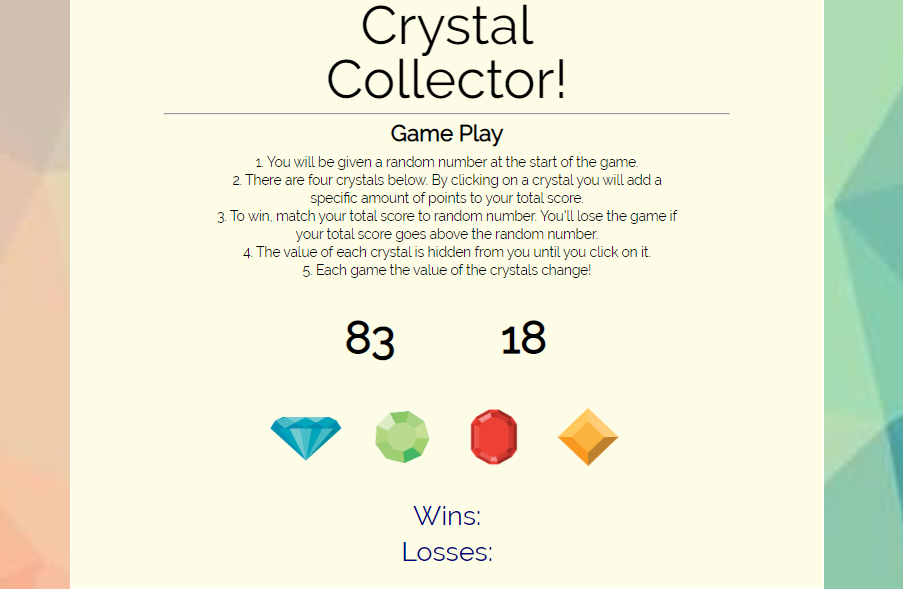

# CRYSTAL COLLECTOR 

  

<h2>Follow Link to Play: </h2>
https://zsievers.github.io/Crystal-Collector/  

<h4>The Game</h4>  

On load, a random number is chosen from 19-120. The goal is to click and remember what crystals  
    are assigned what values to equal the Target Number without going over. If you succeed, you win.  
    If you go over the Target Number, you lose. 

<h4>Technologies Used</h4>

<li>Bootstrap layout</li>
<li>CSS</li>
<li>Javascript and jQuery</li>

